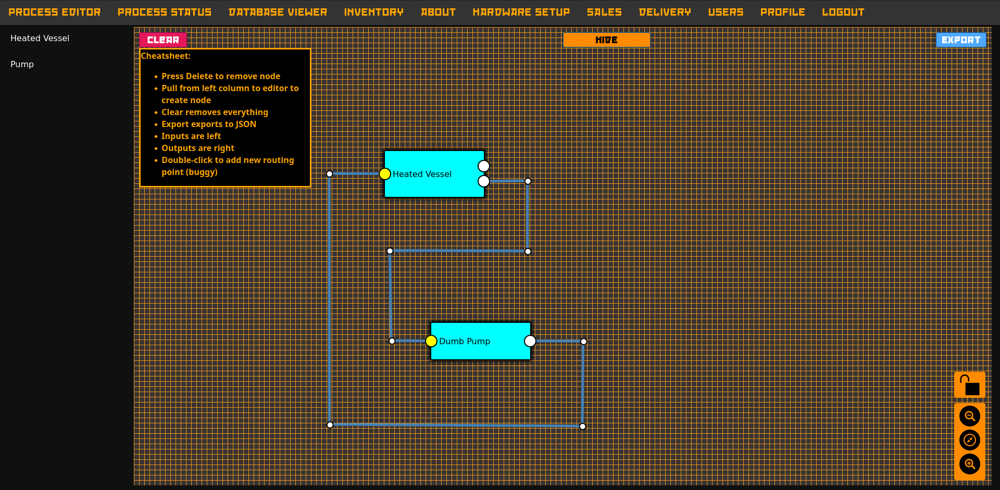

### Work in Progress!



A somewhat recent picture of the UI

# Introduction
When this software is finally useable (which is not at the moment), it should be a simple to use process design and supervision system for any kind of 
project. To achieve this goal it is split into the process editor - a design interface to create your own process dashboard, expandable with your own "themes".
The other part is a control dashboard, which will allow you to supervise and control your process and log all necessary information.
While originally designed for homebrewing applications, I have decided to expand the scope to a more generalized manner as I have come to the conclusion that
all processes are in essence created equal. 

It is written in python using the Flask microframework. For the process editor, Drawflow.io is being used. All parts of the software may be subject to change.


# Roadmap
A roadmap for the development of the suite.

### Release 0.1
In Version 0.01 it should be possible to: 
- Create and save a SCADA type view of a process
- Create and save a process recipe for process automation 
- Connect hardware that runs the STEVE client to ADAM
- Add additional process nodes
The version 0.01 shall contain the necessary basics needed to design, view and control a process using multiple hardware devices. 

### Release 0.2
- Inventory by QrCode should be possible
- Integration of Inventory and Process

### Release 0.3:
- Sales system is integrated with inventory system

### Release 0.4:
- Delivery system is integrated with inventory system, using OSM to display markers of delivery locations, allowing for easy route planning - no I will not, ever, never, integrate Google Maps into this. As a matter of fact I am annoyed that some of the components (either Drawflow or QrCode reader) use Google products, and I will attempt to stip them out without breaking their funcionality.

### Release 0.5:
- Refactoring of the code, optimizations

### Releases 0.6-0.9
- Implemenet features asked for by users, remove bugs, make sure the software is stable

### Release 1.0
- Final release. The software works as intended and is safe to use. 

# Usage

Enter these commands in the unix terminal:
```
git clone https://github.com/olutmatkaijian/ADAM.git
cd ADAM
chmod +x install_script.sh
./install_script.sh
```
This will generate a virtual environment located in ADAM_VENV, initialize the databases and create an initial user `administrator` with the password `administrator`. After first log in, you are asked to change the password. It must be at least 8 characters and include one upper case letter, on lower case letter and one special character. 
After that you will be logged out automatically and taken back to the login-page. There you can login with username `administrator` and the password you have entered previously.

The install script runs the ADAM Server for exactly 10 minutes. In order to restart it, do the following:
```
source ADAM_VENV/bin/activate
./run.sh
```

The above command will run it indefinitely. In order to stop it, use CTRL+C in the terminal you ran it from. 

If you wish to only run it for a specific time:

```
timeout <time in h/m/s/Y> gunicorn -k gevent -w 1 -b :5000 adam_v2:app --certfile=testing.crt --keyfile=testing.key
```

So to run it for 4 hours: 
```
timeout 4h gunicorn -k gevent -w 1 -b :5000 adam_v2:app --certfile=testing.crt --keyfile=testing.key
```


**NOTE ABOUT DATABASE VIEWER**: To use the Database Viewer, you must have [schemacrawler](https://www.schemacrawler.com/) installed in ADAM/schemacrawler directory.

# Recent Changes
- (Partially) Implemented the GUI for the Process Editor. 
- Added nimiq QrCode Scanner for Inventory system (not attached to anything yet)
- Pepped up the design a bit
- Added install script!

# TODO
- Redo database schema, connect databases
- Sales / Customers / Delivery / Interfaces Dashboards
- Fix UUID Scheme for STEVE

# Credit
- [Flask](https://flask.palletsprojects.com/en/2.0.x/) Glues it all together
- [Drawflow](https://github.com/jerosoler/Drawflow) For the Drag-And-Drop Process Editor interface
- [SchemaCrawler](https://www.schemacrawler.com/) For the Database Viewer (to make development easier)
- [nimiq lightweight qr code readr](https://github.com/nimiq/qr-scanner) for scanning qr code
- [Red October](https://www.neogrey.com/portfolio/red-october/) font for the top navigation bar 
- [CraftbeerPi-UI-Widgets](https://github.com/craftbeerpi/craftbeerpi-ui-widgets) For the widgets in the process editor 

Probably quite a few others I have forgotten to add. If you're not listed, well, I'm sorry. 
