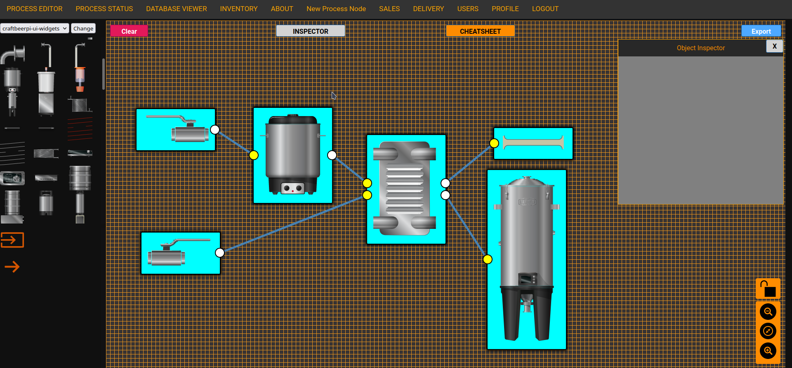

### Work in Progress!



A somewhat recent picture of the UI

# Recent Changes
27/05/22: Further implementation of the Process Editor. It is now possible to load any SVG into the process editor by adding a folder in the "themes" directory. Select the correct theme using the "change theme" button on the top right. 

29/05/22: Bug fixed in Process Editor. Dynamic adding of Input/Output to node elements. Removing them is not possible at the moment as this will delete the node. 

31/05/22: Implemented first parts of functionality towards the object inspector. The Object Inspector will work in the following manner: When a user selects a node AND the object inspector is currently visible, it load all variables of the selected object into a two column table. In this table, users will be able to enter data, which will then be translated to the corresponding object. This will allow the user to change for example the name of a process object. 

02/06/22: The object inspector now works almost as intended. Names, classes, html and data of nodes can now be changed, but it still is slightly buggy. Disabled boxes are managed by drawflow, and cannot be changed by the user. 

# Introduction
The goal of ADAM is to allow users of various skill levels to create process interfaces using a drag and drop interface, while also allowing users to design / "program" the process in a drag-and-drop manner. These processes can then be supervised in real time using the process viewer.
There are further features that might be implemented when the process control part of ADAM works as intended, but as I have little time now to spend on it, I am focusing on the main objective: That is to create, control and supervise processes from an easy to use web interface.

It is to be noted that ADAM is in pre-alpha stage. This means it does not yet work as intended. While it is possible to run it, doing so is of no use for anybody who is not considering to develop it further. You have been warned. 

# Why make a new software?
I have been asked by some people why I would create a new software and don't just use for example CraftBeerPi or RapidSCADA. The reason is simple: That is not the software I envision using. CraftBeerPi is very specialized towards the control of brewing processes. The RapidSCADA interface and usage is very complicated in my humble opintion - that is to say, it is not a bad software, it's just not what I wish to use. 
ADAM aims to be simple to use but have the general flexibility to allow for more complicated process designs. During my development of ADAM I have come to the conclusion that most use cases of process control are very similar: "Turn on X", "Keep at Temp Y", "Turn Off" for example. To this end, I have decided to write a software for this purpose.
Furthermore, I enjoy learning about this kind of stuff and I very much prefer the learning by doing approach. I also want to make it as simple as possible to setup, reflected in the few rather simplistic but very useful scripts I wrote to install and run it. 

# Technical: How does it work?
I use the [Drawflow](https://github.com/jerosoler/Drawflow) for the drag and drop editor. This is a JavaScript library that allows users to create flowcharts using drag and drop. Behind this, I run [Flask](https://flask.palletsprojects.com/en/2.0.x/) for the logical parts of the software and to interface with hardware - this is currently only implemented so rudimentarily it might as well not exist. At the beginning I used asyncio to control the process and got good results with it, but am seriously considering to move to MQTT or similar. 
ADAM is only one part of the software. I have also written another piece of software - STEVE - which can be run on a raspberry pi for example. When a process is to be run, ADAM will send all important process information to STEVE. Using this information the process will be run while continously sending data back to ADAM. This is done in this manner for a simple manner: should the connection to ADAM be impaired at any point of time it should not affect the outcome of the process. STEVE should be able to work independently from ADAM until the process is finished.
As further redundancy at some point a human to machine interface has to be implemented in STEVE, for example by touch screen. This way, the process can be supervised and controlled even if the connection to ADAM is impaired or severed.


# TODO
- ~~Make it so that when an object in the process editor is moved by clicking on the image, it does not spawn an empty node)~~ (Fixed 29/05/22)
- ~~(Add functionality: Add I/O connectors to nodes by dragging and dropping them)~~ (Fixed 29/05/22)
- Add functionality: Add an object inspector which displays node information and allows to change if necessary
- Add functionality: Add drag-and-drop for HTML fields like InputField or RadioButton, Sliders, Labels, etc so that when they are dropped onto a node, they are automatically attached to it. 
- Visual: Make the process editor show only the image and not the div
- Add functionality: resizing of process editor nodes
- Add functionality: Snapping nodes together at inputs and outputs


# Roadmap
A roadmap for the development of the suite.

### Release 0.1
In Version 0.01 it should be possible to: 
- Create and save a SCADA type view of a process
- Create and save a process recipe for process automation 
- Connect hardware that runs the STEVE client to ADAM
- Add additional process nodes
The version 0.01 shall contain the necessary basics needed to design, view and control a process using multiple hardware devices. 

### Release 0.2
- Inventory by QrCode should be possible
- Integration of Inventory and Process

### Release 0.3:
- Sales system is integrated with inventory system

### Release 0.4:
- Delivery system is integrated with inventory system, using OSM to display markers of delivery locations, allowing for easy route planning - no I will not, ever, never, integrate Google Maps into this. As a matter of fact I am annoyed that some of the components (either Drawflow or QrCode reader) use Google products, and I will attempt to stip them out without breaking their funcionality.

### Release 0.5:
- Refactoring of the code, optimizations

### Releases 0.6-0.9
- Implemenet features asked for by users, remove bugs, make sure the software is stable

### Release 1.0
- Final release. The software works as intended and is safe to use. 

# Usage

Enter these commands in the unix terminal:
```
git clone https://github.com/olutmatkaijian/ADAM.git
cd ADAM
chmod +x install_script.sh
./install_script.sh
```
This will generate a virtual environment located in ADAM_VENV, initialize the databases and create an initial user `administrator` with the password `administrator`. After first log in, you are asked to change the password. It must be at least 8 characters and include one upper case letter, on lower case letter and one special character. 
After that you will be logged out automatically and taken back to the login-page. There you can login with username `administrator` and the password you have entered previously.

The install script runs the ADAM Server for exactly 10 minutes. In order to restart it, do the following:
```
source ADAM_VENV/bin/activate
./run.sh
```

The above command will run it indefinitely. In order to stop it, use CTRL+C in the terminal you ran it from. 

If you wish to only run it for a specific time:

```
timeout <time in h/m/s/Y> gunicorn -k gevent -w 1 -b :5000 adam_v2:app --certfile=testing.crt --keyfile=testing.key
```

So to run it for 4 hours: 
```
timeout 4h gunicorn -k gevent -w 1 -b :5000 adam_v2:app --certfile=testing.crt --keyfile=testing.key
```


**NOTE ABOUT DATABASE VIEWER**: To use the Database Viewer, you must have [schemacrawler](https://www.schemacrawler.com/) installed in ADAM/schemacrawler directory.


# Credit
- [Flask](https://flask.palletsprojects.com/en/2.0.x/) Glues it all together
- [Drawflow](https://github.com/jerosoler/Drawflow) For the Drag-And-Drop Process Editor interface
- [SchemaCrawler](https://www.schemacrawler.com/) For the Database Viewer (to make development easier)
- [nimiq lightweight qr code readr](https://github.com/nimiq/qr-scanner) for scanning qr code
- [Red October](https://www.neogrey.com/portfolio/red-october/) font for the top navigation bar 
- [CraftbeerPi-UI-Widgets](https://github.com/craftbeerpi/craftbeerpi-ui-widgets) For the widgets in the process editor 

Probably quite a few others I have forgotten to add. If you're not listed, well, I'm sorry. 
